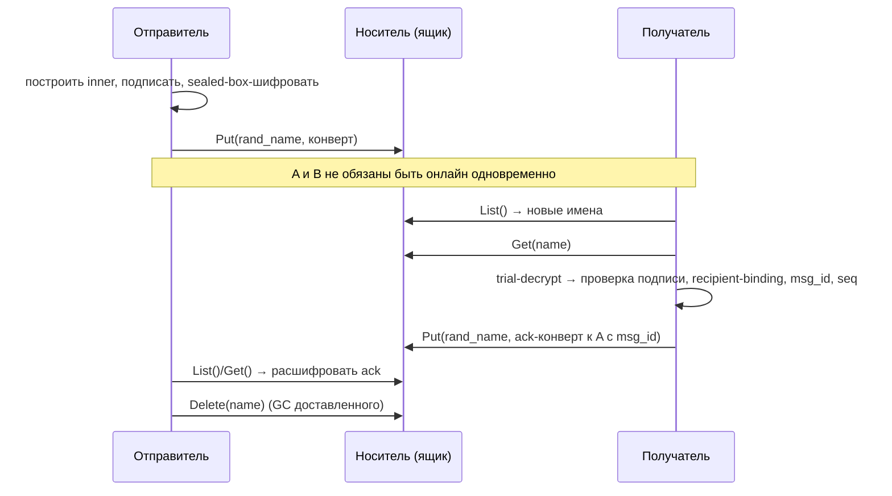
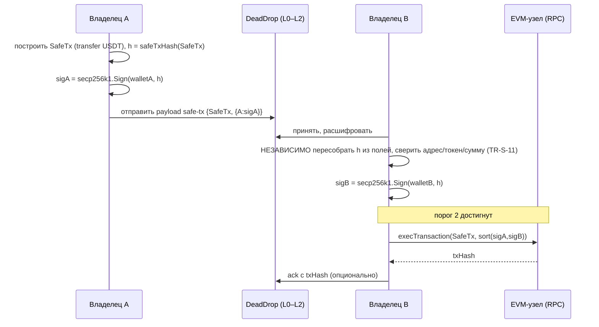

# Архитектура и проектные решения

Документ описывает архитектуру системы DeadDrop и обоснование ключевых проектных
решений. Опирается на [КОНЦЕПЦИЮ](КОНЦЕПЦИЯ.md) и
[модель угроз и требования](МОДЕЛЬ_УГРОЗ_И_ТРЕБОВАНИЯ.md); ссылки вида TR-* и T-*
относятся к требованиям и угрозам из этих документов.

---

## 1. Обзор

DeadDrop — система сквозного безопасного асинхронного обмена сообщениями и
криптовалютными транзакционными данными через недоверенный носитель. Архитектура
— четыре слоя с двумя точками расширения (носитель снизу, тип нагрузки сверху):

```
        ┌─────────────────────────────────────────────────────────┐
  L3    │  Payload     интерфейс нагрузки  →  text | cryptotx(Safe) │   точка расширения
        ├─────────────────────────────────────────────────────────┤
  L2    │  Crypto      личности, sealed-box+подпись, suite_id       │
        ├─────────────────────────────────────────────────────────┤
  L1    │  Drop        конверты, ящик, publish/poll/ack/GC          │
        ├─────────────────────────────────────────────────────────┤
  L0    │  Carrier     Put/Get/List/Delete  →  fs | webdav | multi  │   точка расширения
        └─────────────────────────────────────────────────────────┘
                                 │
                     недоверенный носитель (папка / облако / документ)
```

Принцип разделения ответственности: **носитель ничего не гарантирует** (может
читать, изменять, удалять, повторять, блокировать), поэтому конфиденциальность,
целостность, подлинность и анонимность обеспечиваются исключительно слоями L1–L2,
а непрерывность под блокировкой — слоем L0 (мульти-носитель).

---

## 2. L0 — Carrier (носитель)

### 2.1. Контракт

Минимальный интерфейс — наименьший общий знаменатель для папки, облака и
расшаренного документа. Carrier привязан к одному «ящику» (drop) — плоскому
пространству именованных блобов.

```go
type Carrier interface {
    Put(name string, data []byte) error   // атомарная публикация (overwrite допустим)
    Get(name string) ([]byte, error)      // ErrNotExist, если нет
    List() ([]string, error)              // имена в ящике; отсутствующий ящик → пусто, без ошибки
    Delete(name string) error             // идемпотентно (отсутствие = успех)
}
```

Семантика (контракт, на который опираются верхние слои):
- **Атомарность публикации** — наблюдатель листинга видит блоб либо целиком, либо
  не видит вовсе (для ФС — запись во временный файл + rename; для WebDAV — PUT
  атомарен с точки зрения листинга).
- **Идемпотентность Delete** — 404 трактуется как успех.
- **Отсутствующий ящик листится как пустой** — отличать «пусто» от «ошибка
  доступа» нельзя по List; для этого нет отдельного метода (упрощение контракта).

### 2.2. Реализации

| Backend | Назначение | Заметки |
|---|---|---|
| `fs` | папка (в т.ч. примонтированное облако) | tmp+rename для атомарности |
| `mem` | тесты | потокобезопасная карта, эмуляция mtime |
| `webdav` | облако (Yandex.Disk и др.) | PROPFIND/GET/PUT/DELETE; ретраи с backoff и `Retry-After` на 429; кэш созданных коллекций |
| `multi` | устойчивость к блокировке | композиция нескольких Carrier (см. 2.4) |

Реализации `fs`/`webdav` переиспользуют наработки rctun (там это интерфейс
`Store`); в DeadDrop контракт ужат до четырёх операций над плоским ящиком.

### 2.3. Классификация носителей

- **Namespace-носитель** — много именованных блобов (папка, WebDAV, S3, IPFS).
  Прямо реализует `Carrier`.
- **Одно-слотовый носитель** — один изменяемый документ (расшаренный Google Doc,
  одна запись pastebin). Поддерживается **адаптером**, который виртуализирует
  пространство имён внутри одного блоба (append-only лог записей
  `{name, data}` с компакцией). Так контракт `Carrier` остаётся единым.

### 2.4. Мульти-носитель и непрерывность (TR-F-5, TR-S-9, T9)

`multi.Carrier` оборачивает N носителей:
- **Запись — зеркалирование** на K из N (по умолчанию K=2): один и тот же блоб с
  одним и тем же случайным именем пишется на несколько носителей. Блокировка
  одного не теряет сообщение.
- **Чтение — слияние** листингов всех носителей с дедупликацией по имени блоба
  (имена случайны и уникальны); недоступный носитель пропускается.
- **Дедупликация второго уровня** — на стороне получателя по `msg_id` после
  расшифровки (защита от дублей при частичной доступности).

> **Решение DR-6.** Зеркалирование (K из N), а не failover-only. *Почему:* цель —
> непрерывность под блокировкой, а не минимизация трафика. *Цена:* кратный объём
> и квоты. *Компромисс:* K настраивается; при K=1 поведение вырождается в
> failover.

---

## 3. L1 — Drop (протокол ящика)

### 3.1. Формат конверта

Конверт — единственный блоб на носителе; имя блоба — **случайные 128 бит** (hex),
не несут адресной информации (TR-S-5). Формат уточняет эскиз из концепции,
добавляя `suite_id` и длиннопрефиксные поля ради криптоагильности (TR-C-1).

```
Открытый заголовок (AAD, не шифруется):
  magic        4   "DDE1"
  version      1   0x01
  suite_id     1   идентификатор криптонабора
  eph_pub_len  1 ; eph_pub  eph_pub_len
  nonce_len    1 ; nonce    nonce_len
  ct_len       4 (BE) ; ciphertext  ct_len

ciphertext = AEAD.Seal(key, nonce, inner, aad = magic|version|suite_id|eph_pub)

inner (расшифрованное, каноническая длиннопрефиксная сериализация):
  inner_ver        1
  msg_id           16
  sender_sig_pub   len+bytes
  timestamp        8 (unix ms, BE) — справочно, не доверяется
  conv_id          16            — идентификатор диалога/нити
  seq              8 (BE)        — порядковый номер в диалоге (контроль непрерывности)
  payload_type     len+utf8
  payload          len4+bytes
  sig              len+bytes

sig = Sign(sender_sig_priv,
           DOMAIN | suite_id | recipient_enc_pub | msg_id | conv_id | seq
                  | payload_type | payload)
```

Ключевые свойства формата:
- `suite_id` + длиннопрефиксные `eph_pub`/`nonce`/`sig` → смена криптонабора
  (в т.ч. на ГОСТ с другими размерами) не меняет формат (TR-C-1, DR-5).
- Подпись внутри шифртекста (**sign-then-encrypt**) → носитель не видит ни
  содержимого, ни личности отправителя (T1, T2, T6; DR-3).
- Подпись покрывает `recipient_enc_pub` → защита от переадресации конверта другому
  получателю (T8, TR-S-4).
- AAD покрывает открытый заголовок → подмена `eph_pub`/`suite_id` ломает тег.

### 3.2. Модель ящика и анонимность получателя (TR-S-5, T3, T4)

Все участники пишут конверты в **один общий ящик** со случайными именами. Нет
отдельных подкаталогов на получателя — иначе носитель видел бы граф общения.

Приём: участник периодически делает `List`, ведёт множество уже виденных имён,
скачивает новые блобы и **пробует расшифровать** (trial-decrypt). Успешное
открытие AEAD означает «это мне». Подтверждения (ack) — такие же конверты в том же
ящике, поэтому **неотличимы** от обычных сообщений (вклад в TR-S-12).

> **Решение DR-2.** Плоский общий ящик + случайные имена + trial-decrypt.
> *Почему:* анонимность получателя и неотличимость ack. *Альтернатива:* ящик на
> получателя — отвергнута (утечка графа). *Цена:* trial-decrypt — O(новых блобов)
> на участника. *Митигация:* опциональный детект-тег из общего секрета (развитие);
> для прототипа — приемлемо.

### 3.3. Жизненный цикл сообщения



- **Подтверждения (ack)** — отдельный `payload_type="ack"`, зашифрованный
  отправителю, со ссылкой на `msg_id`. По ack отправитель удаляет исходный блоб.
- **Сборка мусора (GC)** — отправитель удаляет подтверждённые блобы; обе стороны
  чистят старые ack; для недоставленного — TTL (конфигурируемо), чтобы ящик не рос.
- **Защита от повтора (T7, TR-S-3)** — получатель хранит множество принятых
  `msg_id`; повтор отбрасывается.
- **Непрерывность (T9, TR-S-9)** — `conv_id`+`seq` дают обнаружение пропусков;
  поверх мульти-носителя (L0) это превращается в устойчивость к блокировке.

### 3.4. Время и порядок

`timestamp` справочный — ни носителю, ни часам доверять нельзя. Порядок и
обнаружение пропусков — по `seq` в рамках `conv_id` (DR-9).

---

## 4. L2 — Crypto (криптографический слой)

### 4.1. Личности

Каждый участник имеет **две** пары ключей; разделение по назначению (TR-K-1):

```go
type Identity struct {
    Suite           byte
    EncPriv, EncPub []byte // согласование ключей (X25519 в основном наборе)
    SigPriv, SigPub []byte // подпись (Ed25519 в основном наборе)
}

type Contact struct { // публичная «карточка» корреспондента
    Suite           byte
    EncPub, SigPub  []byte
}
```

**Отпечаток** для внеполосной сверки (TR-S-8, T10): `fingerprint =
H(suite || EncPub || SigPub)`, отображается группами (по образцу safety-number
Signal). Сверка отпечатка по отдельному каналу исключает подмену ключей при их
первичном распространении.

### 4.2. Криптонабор (crypto-agility, TR-C-1, DR-5)

Алгоритмы спрятаны за интерфейсом; `suite_id` в конверте выбирает набор:

```go
type Suite interface {
    ID() byte
    GenerateEphemeral() (ephPriv, ephPub []byte, err error)
    DH(priv, peerPub []byte) ([]byte, error)
    KDF(shared, info []byte) []byte
    NonceSize() int
    Seal(key, nonce, plaintext, aad []byte) []byte
    Open(key, nonce, ciphertext, aad []byte) ([]byte, error)
    Sign(priv, msg []byte) []byte
    Verify(pub, msg, sig []byte) bool
}
```

- `suite 0x01` (**основной**): X25519 + HKDF-SHA-256 + XChaCha20-Poly1305 +
  Ed25519. Все примитивы — `stdlib`/`golang.org/x/crypto`, выверены, constant-time
  (TR-C-2).
- `suite 0x02` (**опционально**, вне целевого применения): ГОСТ-набор через
  сертифицированное СКЗИ (TR-C-3). Формат конверта и протокол не меняются.

Ключи личности привязаны к набору; обе стороны должны разделять `suite_id`.

### 4.3. Конструкция «sealed-box + эфемерный ключ»

Шифрование к офлайн-получателю (асинхронность) с односторонней прямой
секретностью:

```
Отправка к получателю R:
  (ephPriv, ephPub) ← Suite.GenerateEphemeral()
  shared            ← Suite.DH(ephPriv, R.EncPub)
  key               ← Suite.KDF(shared, info="deaddrop-v1")
  inner             ← сериализация с подписью (sign-then-encrypt)
  ct                ← Suite.Seal(key, nonce, inner, aad=header)
  ephPriv           ← уничтожить            (← прямая секретность отправителя)
```

```mermaid
sequenceDiagram
    participant A as Отправитель
    participant B as Получатель
    A->>A: eph = ephemeral(); shared = DH(eph_priv, B.EncPub)
    A->>A: key = KDF(shared); sig = Sign(A.SigPriv, ctx)
    A->>A: ct = Seal(key, nonce, inner{...,sig}, aad)
    A-->>B: конверт {eph_pub, nonce, ct}
    B->>B: shared = DH(B.EncPriv, eph_pub); key = KDF(shared)
    B->>B: inner = Open(key, nonce, ct, aad)  // неуспех ⇒ "не мне"
    B->>B: Verify(A.SigPub, ctx, sig) ∧ recipient==B ∧ msg_id нов.
```

> **Решение DR-4.** Sealed-box с эфемерным ключом (односторонняя FS). *Почему:*
> прост, отправка офлайн-получателю, эфемерный ключ уничтожается. *Ограничение
> (T11):* компрометация долговременного ключа получателя раскрывает прошлое.
> *Альтернатива:* X3DH + Double Ratchet (полная FS и восстановление после
> компрометации) — отложено; `suite_id`/формат оставляют место для перехода.

### 4.4. Свойства безопасности слоя

| Свойство | Механизм | Угроза |
|---|---|---|
| Конфиденциальность | AEAD к ключу из ECDH | T1, T2 |
| Целостность/подлинность | AEAD-тег + подпись отправителя | T5, T6 |
| Привязка к получателю | подпись покрывает `recipient_enc_pub` | T8 |
| Анонимность отправителя для носителя | sign-then-encrypt | T3 |
| Прямая секретность (отправитель) | эфемерный ключ на сообщение | T11 (частично) |
| Защита ключей | генерация/хранение только на конечной точке | T12 (снижение) |

---

## 5. L3 — Payload (полезная нагрузка)

### 5.1. Интерфейс и реестр

Нагрузка — расширяемая; ядро (L0–L2) не зависит от её типа.

```go
type Payload interface {
    Type() string            // тег, кладётся в конверт (payload_type)
    Encode() ([]byte, error)
}

type Handler interface {
    Type() string
    Decode([]byte) (Payload, error)
    Handle(from Contact, p Payload) error
}
// registry: payload_type → Handler
```

Типы: `text` (произвольный текст/чат), `ack` (служебный), `safe-tx`
(криптовалютный пример).

### 5.2. Криптовалютный пример: мультиподпись Safe (EVM)

**Две независимые системы ключей** (важное проектное разграничение):
- **Канальные** ключи DeadDrop (Ed25519/X25519) — защищают *передачу* конверта.
- **Кошельковые** ключи владельцев Safe (secp256k1, EOA) — подписывают *транзакцию*.

Нагрузка `safe-tx` несёт поля транзакции Safe и собранные подписи владельцев:

```go
type SafeTx struct {
    ChainID        uint64
    Safe           Address // адрес смарт-контракта Safe (verifyingContract)
    To             Address // контракт стейблкоина (ERC-20)
    Value          *big.Int
    Data           []byte  // ABI: transfer(recipient, amount)
    Operation      uint8   // 0 = CALL
    SafeTxGas, BaseGas, GasPrice *big.Int
    GasToken, RefundReceiver     Address
    Nonce          uint64
    Signatures     map[Address][]byte // owner → подпись над safeTxHash
}
```

`safeTxHash` = EIP-712: `keccak256(0x19 0x01 || domainSeparator(chainId, Safe) ||
hashStruct(SafeTx))`. Владелец подписывает именно `safeTxHash` ключом secp256k1.



- **TR-S-11 / T13.** Независимая сверка `safeTxHash` и реквизитов каждым
  подписантом до подписи — защита от подмены реквизитов недобросовестной стороной
  или носителем. Это требование реализуется на L3, а не в крипто-протоколе.
- **Разграничение по ФЗ-259/ЭПР.** Система передаёт артефакт (`SafeTx` + подписи);
  `execTransaction` и broadcast выполняются отдельно через RPC-узел — система не
  ведёт расчётов и не хранит средства.

> **Решение DR-8.** Публикация транзакции в сеть — вне защищённого канала
> (отдельный RPC). *Почему:* разделение ответственности и правовая чистота
> (не расчётный сервис).

---

## 6. Сквозные решения

### 6.1. Структура Go-модуля

```
deaddrop/                       module deaddrop
  carrier/   carrier.go fs.go mem.go webdav.go multi.go      L0
  drop/      envelope.go mailbox.go gc.go                    L1
  crypto/    identity.go suite.go suite_modern.go fingerprint.go   L2
  message/   payload.go registry.go text.go ack.go
             cryptotx/ safetx.go eip712.go submit.go         L3
  cmd/abox/  main.go    (keygen | send | recv | safe-propose | safe-cosign | safe-exec)
```

### 6.2. Зависимости

- **Ядро (L0–L2)** — только `stdlib` + `golang.org/x/crypto` (`curve25519`,
  `chacha20poly1305`, `hkdf`; `ed25519` — stdlib). Никаких тяжёлых зависимостей.
- **`cryptotx`** — `go-ethereum` (EIP-712, ABI, secp256k1) изолирован в L3, чтобы
  не тянуть его в ядро.

> **Решение DR-7.** Тяжёлая EVM-зависимость заперта в L3. *Почему:* ядро остаётся
> малым, переносимым и легко аудируемым; смена примера нагрузки не затрагивает
> ядро.

### 6.3. Сериализация

- Конверт и `inner` — собственная **каноническая длиннопрефиксная** двоичная
  сериализация (детерминирована, важно для воспроизводимости подписи).
- Нагрузки сериализуют себя сами (`Payload.Encode`); `safe-tx` — каноническое
  кодирование полей.

### 6.4. Обработка ошибок и устойчивость

- Различать «не мне» (неуспех `Open`) и транспортную ошибку носителя — первое не
  логируется как сбой.
- Транзиентные ошибки носителя (сеть, 429/5xx) — ретраи с экспоненциальным
  backoff и учётом `Retry-After` (перенесено из rctun).
- Поллинг — одна горутина на ящик; множество виденных `msg_id`/имён —
  потокобезопасно.

### 6.5. Тестирование

- `mem`-носитель — модульные и интеграционные тесты L1–L2 (round-trip конверта,
  анонимность, replay, переадресация).
- `safe-tx` — корректность `safeTxHash`/подписей против эталона; прогон
  `execTransaction` на локальном devnet (anvil/hardhat) с развёрнутым Safe.
- Свойства: round-trip конверта при любой нагрузке; устойчивость к мульти-носителю
  при выпадении части носителей.

---

## 7. Трассировка «решение → требование/угроза»

| Решение / механизм | Слой | Требования | Угрозы |
|---|---|---|---|
| Минимальный контракт Carrier | L0 | TR-F-2 | — |
| Мульти-носитель (зеркалирование+слияние) | L0 | TR-F-5, TR-S-9 | T9 |
| Случайные имена + общий ящик + trial-decrypt | L1 | TR-S-5 | T3, T4 |
| Конверт с `suite_id`, длиннопрефиксные поля | L1/L2 | TR-C-1 | — |
| Sign-then-encrypt | L1/L2 | TR-S-1, TR-S-2 | T1, T2, T6 |
| Подпись покрывает ключ получателя | L1/L2 | TR-S-4 | T8 |
| `msg_id` + множество принятых | L1 | TR-S-3 | T7 |
| `conv_id`+`seq` (непрерывность) | L1 | TR-S-9 | T9 |
| ack неотличим от сообщения; равномерные имена/размеры | L1 | TR-S-12 | T9, T3 |
| Эфемерный ключ на сообщение | L2 | TR-S-7 | T11 |
| Два набора ключей, отпечатки, OOB-сверка | L2 | TR-S-8, TR-K-1/2 | T10 |
| Ключи только на конечной точке | L2 | TR-S-10 | T12 |
| Независимая сверка `safeTxHash` | L3 | TR-S-11 | T13 |
| Криптонабор сменный (modern/ГОСТ) | L2 | TR-C-1/2/3 | — |
| Broadcast вне канала | L3 | — | (правовое разграничение) |

---

## 8. Порядок реализации

Инкрементально, каждый шаг компилируется и покрывается тестами:

1. **L0 `carrier`** — `Carrier` + `fs` + `mem`; затем `webdav`; затем `multi`.
2. **L1 `drop`** — конверт (`suite_id`, длиннопрефиксные поля), ящик
   (publish/poll/ack/GC), replay/seq.
3. **L2 `crypto`** — `identity`, `suite_modern`, sealed-box + sign-then-encrypt,
   отпечатки.
4. **L3 `message`** — реестр, `text`, `ack`; затем `cryptotx` (Safe/EVM) и CLI
   `abox` с прогоном мультиподписи порога 2 и переводом стейблкоина на devnet.

Развитие (за рамками базовой реализации): детект-теги вместо trial-decrypt;
X3DH + Double Ratchet (полная FS); фиктивный трафик и расписание против
тайминг-метаданных; одно-слотовые носители (документ) через адаптер.
